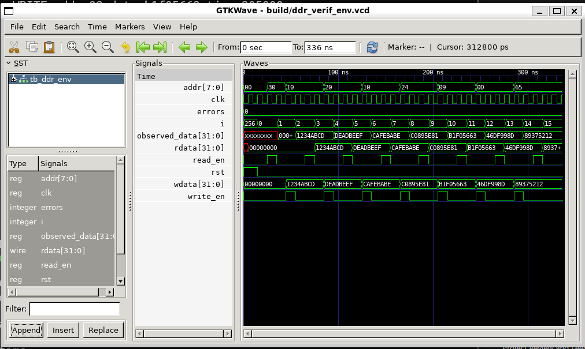

# DDR Controller Verification Environment

This project implements a simplified SystemVerilog verification environment for a DDR-style memory controller.

The verification flow includes transaction generation, driving DUT inputs, monitoring DUT outputs, and scoreboard-based checking of read data.

## Verification Architecture

Generator → Driver → DUT → Monitor → Scoreboard

- Generator creates directed and randomized memory transactions
- Driver applies transactions to the DDR controller
- Monitor observes DUT read/write behavior
- Scoreboard compares observed read data against expected values

## Tools Used

- SystemVerilog
- Icarus Verilog
- GTKWave
- Ubuntu on WSL

## Repository Structure

ddr-controller-verification/
├── docs/
│   └── waveform.png
├── rtl/
│   └── ddr_controller.sv
├── tb/
│   └── tb_ddr_env.sv
└── README.md

## Simulation

Compile:

iverilog -g2012 -Wall -o build/ddr_verif_env.out rtl/ddr_controller.sv tb/tb_ddr_env.sv

Run simulation:

vvp build/ddr_verif_env.out

Open waveform:

gtkwave build/ddr_verif_env.vcd

## Results

The verification environment successfully validated:

- Empty memory read returning 0
- Directed write/read transaction at address 0x10
- Directed write/read transaction at address 0x20
- Overwrite behavior at the same address
- Randomized write/read transactions

Simulation completed with all tests passed.

## Simulation Waveform

Initial unknown (X) values appear during simulation startup before signals are driven or reset.
